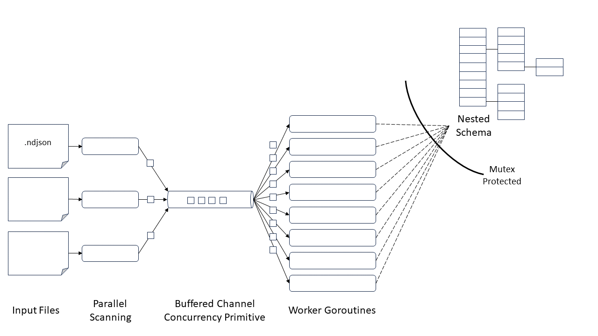

## Design

The technical design of the core is visualized: 

### Key Design Principles:
- Performance through concurrency (using golang channel primitives)
- Big data support through splitted input files
- Enforce consistency checks upstream
- Fail fast in case of an error
- File position traceback to enable debugging

### Constraints:
- A process will generate one schema. To enable generation of different schemas seperate processes need to be instantiated.

### Features:
- Recursively nested and repeated fields
- Core functionality is structured in a reusable packages
- Command line interface (CLI) enabling configurability
- Single binary executable. Should play well together with Google CLI tools like gcloud and bq.
- Basic test automation

### Not supported yet:
- API integration with Google Cloud (Cloud Storage, Bigquery)
- Constraint relaxation for the "Required" attribute 
- No handling for the JSON string literal "null"
- Distribution or clustered deployment
- Schema inference by parsing through repeated records (now the nested schema is based on the first element)
- Incomplete support for string-wrapped types: Timestamp, Time, Date, Geo-types, ...
- Sampling instead of full line-by-line processing
- Deployment on Dataflow

### Example Usage

#### Help command
> ./schemagen help           

            Bigquery schema generator from ndjson input files. More info at: https://github.com/aart/schema-detection

            Usage:
            schemagen [flags]
            schemagen [command]

            Available Commands:
            completion  Generate the autocompletion script for the specified shell
            help        Help about any command
            run

            Flags:
                --buffer-size int      todo (default 1000000)
                --fan-out int          todo (default 1)
            -h, --help                 help for schemagen
                --output-file string   todo (default "schema.json")

            Use "schemagen [command] --help" for more information about a command.

            The project includes some expample data:

#### Usage
> ./schemagen run ./ndjson/test0.ndjson  --fan-out=2 --buffer-size=1000000 --output-file=schema.json

#### For multiple input files, use:

>./schemagen run ./ndjson/benchmark/test1.ndjson ./ndjson/benchmark/test2.ndjson ./ndjson/benchmark/test3.ndjson ./ndjson/benchmark/test4.ndjson ./ndjson/benchmark/test5.ndjson --fan-out=5 --buffer-size=1000000